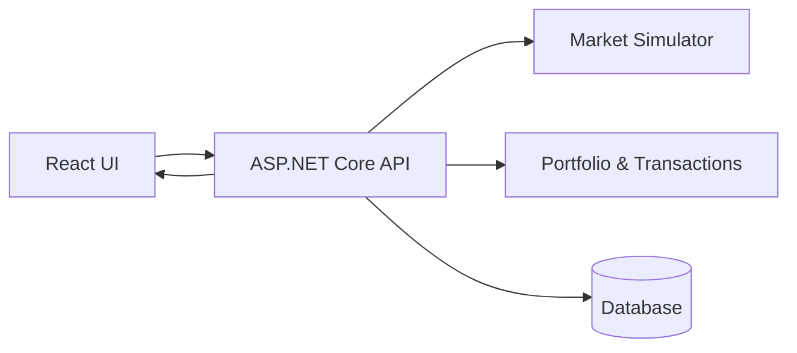

# ReactiveInvestor — Real-Time Stock Market Simulator

**ReactiveInvestor** is a full-stack, event-driven stock market simulation platform built with a modern **.NET backend** and a **React + TypeScript frontend**.

The project demonstrates how to design and implement a **real-time financial system**: from market data simulation and portfolio management to live UI updates and analytical dashboards.

This repository focuses on **system design, backend reliability, and frontend reactivity**, rather than visual polish alone.

---

## What This Project Demonstrates

ReactiveInvestor is not just a UI demo.

It showcases how to:
- design a financial domain (stocks, portfolios, transactions)
- build deterministic and testable backend logic
- stream real-time updates to the client
- keep frontend state synchronized with backend events
- structure a full-stack project for production growth

The same architecture can be applied to:
- trading simulators
- fintech dashboards
- portfolio analytics systems
- real-time monitoring platforms

---

## Key Features

- Stock market simulation with dynamic price changes
- Portfolio and asset management
- Real-time updates of prices and positions
- Event-driven backend architecture
- Reactive frontend with live state updates
- Clear separation of domain, application, and infrastructure layers

---

## High-Level Architecture



**Core idea:** backend owns the source of truth, frontend reacts to state changes.

---

## Backend Overview (.NET)

The backend is built as a cleanly layered ASP.NET Core application.

### Responsibilities
- Market price simulation
- Portfolio calculations
- Transaction processing
- Data persistence
- API orchestration

### Structure

```
api/
  Controllers/    HTTP endpoints
  Models/         Domain models
  Dtos/           API contracts
  Repository/     Data access layer
  Service/        Business logic
  Data/           Database context & migrations
```

The backend emphasizes:
- explicit domain logic
- testability
- clear data flow
- separation of concerns

---

## Frontend Overview (React)

The frontend is a reactive dashboard built with modern web tooling.

### Responsibilities
- Display live market data
- Render portfolio state
- React to backend updates
- Provide user interaction layer

### Tech Highlights
- Component-based architecture
- Typed state management
- API-driven UI updates
- Tailwind-based styling

---

## Technology Stack

### Backend
- **C# / .NET**
- **ASP.NET Core**
- **Entity Framework Core**
- **REST API**
- **LINQ**

### Frontend
- **React**
- **TypeScript**
- **Tailwind CSS**
- **Vite / Node.js**

### Architecture & Tooling
- Event-driven design
- Client–server separation
- DTO-based API contracts
- Modular project structure

---

## Running the Project Locally

### Backend
```bash
cd api
dotnet restore
dotnet run
```

### Frontend
```bash
cd frontend
npm install
npm run dev
```

---

## Design Principles

- Backend as single source of truth
- Deterministic business logic
- Explicit data contracts
- Reactive UI updates
- Scalability-ready architecture

---

## Final Notes

ReactiveInvestor is designed as a **full-stack engineering case**, not a trading bot or real-market tool.

The focus is on:
- financial domain modeling
- real-time system behavior
- clean separation of responsibilities
- production-oriented project structure
